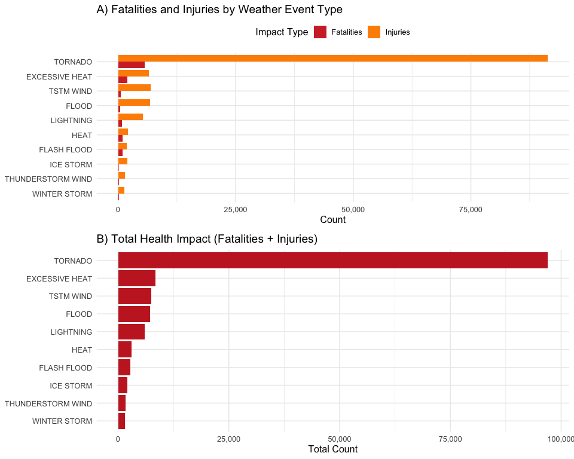
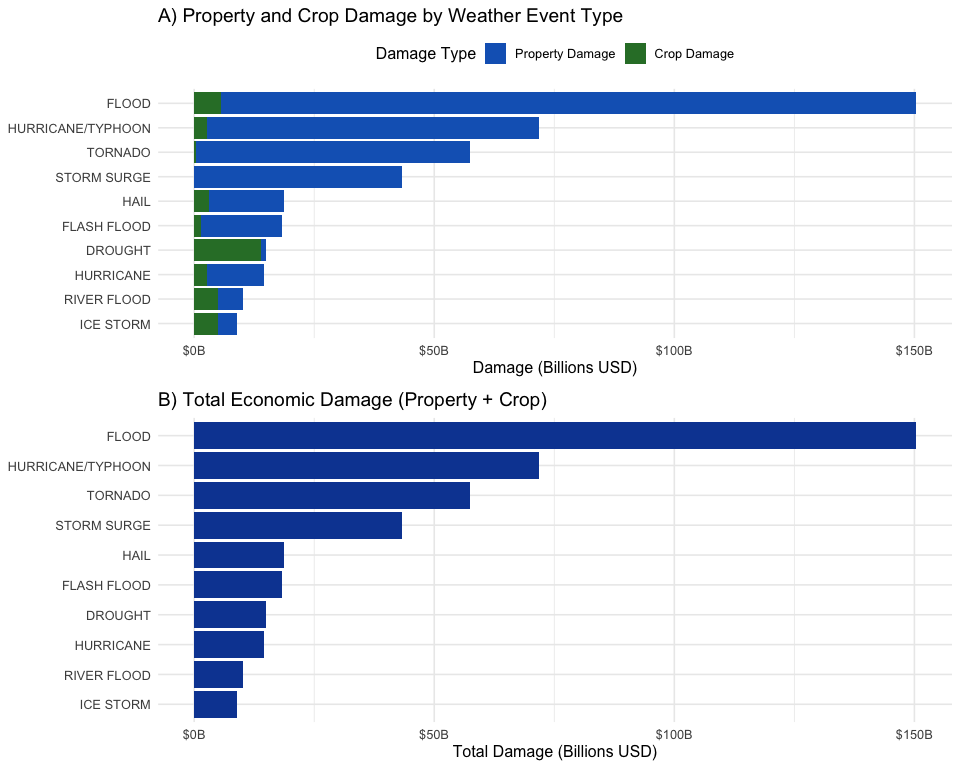
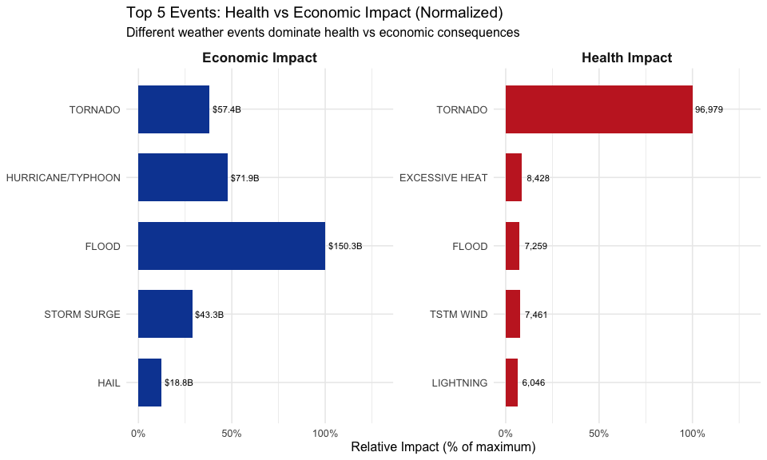

# Impact of Severe Weather Events on Public Health and Economy in the United States

**Author:** Ulises González
**Date:** 2026-02-27

## Synopsis

This analysis explores the U.S. National Oceanic and Atmospheric Administration's (NOAA) storm database to identify the most harmful severe weather events in terms of public health and economic impact. The data spans from 1950 to November 2011 and includes information on fatalities, injuries, property damage, and crop damage across the United States. After cleaning and processing the raw data, we found that **tornados** are by far the most harmful weather events to population health, causing the highest number of both fatalities and injuries. In terms of economic consequences, **floods** cause the greatest total damage when combining property and crop losses, followed by hurricanes/typhoons and storm surges. These findings can help government and municipal managers prioritize resources and preparedness efforts for the most impactful weather events.

## Data Processing

### Loading Required Libraries

```r
library(dplyr)
library(ggplot2)
library(tidyr)
library(scales)
```

### Downloading and Reading the Data

We start from the raw `.csv.bz2` file. The data is downloaded directly from the course website and read into R.

```r
data_url <- "https://d396qusza40orc.cloudfront.net/repdata%2Fdata%2FStormData.csv.bz2"
data_file <- "StormData.csv.bz2"

if (!file.exists(data_file)) {
    download.file(data_url, destfile = data_file, method = "curl")
}

storm_data <- read.csv(data_file)
```

### Exploring the Dataset

```r
dim(storm_data)
## [1] 902297     37
```

The dataset contains **902,297 observations** across **37 variables**.

```
##   EVTYPE FATALITIES INJURIES PROPDMG PROPDMGEXP CROPDMG CROPDMGEXP
## 1 TORNADO          0       15    25.0          K       0
## 2 TORNADO          0        0     2.5          K       0
## 3 TORNADO          0        2    25.0          K       0
## 4 TORNADO          0        2     2.5          K       0
## 5 TORNADO          0        2     2.5          K       0
## 6 TORNADO          0        6     2.5          K       0
```

### Processing Health Impact Data

We aggregate fatalities and injuries by event type to determine which events are most harmful to population health.

```r
health_data <- storm_data %>%
    group_by(EVTYPE) %>%
    summarise(
        fatalities = sum(FATALITIES, na.rm = TRUE),
        injuries = sum(INJURIES, na.rm = TRUE),
        total_health_impact = sum(FATALITIES, na.rm = TRUE) + sum(INJURIES, na.rm = TRUE)
    ) %>%
    arrange(desc(total_health_impact))
```

**Top 10 events by health impact:**

| # | Event Type | Fatalities | Injuries | Total |
|---|-----------|-----------|---------|-------|
| 1 | TORNADO | 5,633 | 91,346 | 96,979 |
| 2 | EXCESSIVE HEAT | 1,903 | 6,525 | 8,428 |
| 3 | TSTM WIND | 504 | 6,957 | 7,461 |
| 4 | FLOOD | 470 | 6,789 | 7,259 |
| 5 | LIGHTNING | 816 | 5,230 | 6,046 |
| 6 | HEAT | 937 | 2,100 | 3,037 |
| 7 | FLASH FLOOD | 978 | 1,777 | 2,755 |
| 8 | ICE STORM | 89 | 1,975 | 2,064 |
| 9 | THUNDERSTORM WIND | 133 | 1,488 | 1,621 |
| 10 | WINTER STORM | 206 | 1,321 | 1,527 |

### Processing Economic Impact Data

Property and crop damage values use exponent codes (`PROPDMGEXP` and `CROPDMGEXP`) to indicate magnitude. We convert these codes to numeric multipliers and compute actual dollar amounts.

```r
convert_exp <- function(exp) {
    exp <- toupper(as.character(exp))
    case_when(
        exp == "H" ~ 1e2,
        exp == "K" ~ 1e3,
        exp == "M" ~ 1e6,
        exp == "B" ~ 1e9,
        exp %in% as.character(0:9) ~ 10^as.numeric(exp),
        TRUE ~ 1
    )
}

economic_data <- storm_data %>%
    mutate(
        prop_multiplier = convert_exp(PROPDMGEXP),
        crop_multiplier = convert_exp(CROPDMGEXP),
        property_damage = PROPDMG * prop_multiplier,
        crop_damage = CROPDMG * crop_multiplier,
        total_damage = property_damage + crop_damage
    )
```

**Top 10 events by economic impact:**

| # | Event Type | Property Damage | Crop Damage | Total Damage |
|---|-----------|----------------|------------|-------------|
| 1 | FLOOD | $144.7B | $5.7B | $150.3B |
| 2 | HURRICANE/TYPHOON | $69.3B | $2.6B | $71.9B |
| 3 | TORNADO | $56.9B | $0.4B | $57.4B |
| 4 | STORM SURGE | $43.3B | $0.0B | $43.3B |
| 5 | HAIL | $15.7B | $3.0B | $18.8B |
| 6 | FLASH FLOOD | $16.8B | $1.4B | $18.2B |
| 7 | DROUGHT | $1.0B | $14.0B | $15.0B |
| 8 | HURRICANE | $11.9B | $2.7B | $14.6B |
| 9 | RIVER FLOOD | $5.1B | $5.0B | $10.1B |
| 10 | ICE STORM | $3.9B | $5.0B | $9.0B |

## Results

### Question 1: Events Most Harmful to Population Health



**Key finding:** Tornados are overwhelmingly the most harmful weather event type to population health, causing **5,633** fatalities and **91,346** injuries over the period of record.

### Question 2: Events with Greatest Economic Consequences



**Key finding:** Floods cause the greatest total economic damage, with over **$150.3 billion** in combined property and crop losses. Hurricanes/typhoons and storm surges follow as the next most costly event types.

### Summary: Health vs Economic Impact Comparison



## Conclusions

1. **Population Health:** Tornados are the single most dangerous weather event, responsible for the most fatalities and injuries combined. Excessive heat ranks second for fatalities, while thunderstorm winds rank second for injuries.

2. **Economic Consequences:** Floods cause the greatest total economic damage, primarily through property destruction. Hurricanes/typhoons and storm surges are also major economic threats. Drought stands out as causing disproportionately high crop damage relative to property damage.

3. **Policy Implication:** Resources for public health preparedness should prioritize tornado warning systems and shelters, while economic preparedness should focus on flood mitigation infrastructure and hurricane resilience.

## Reproducibility

The full analysis is available in [`PA2_StormAnalysis.Rmd`](PA2_StormAnalysis.Rmd). To reproduce:

```r
rmarkdown::render("PA2_StormAnalysis.Rmd")
```

The rendered report is available as:
- [HTML](PA2_StormAnalysis.html)
- [PDF](PA2_StormAnalysis.pdf)
